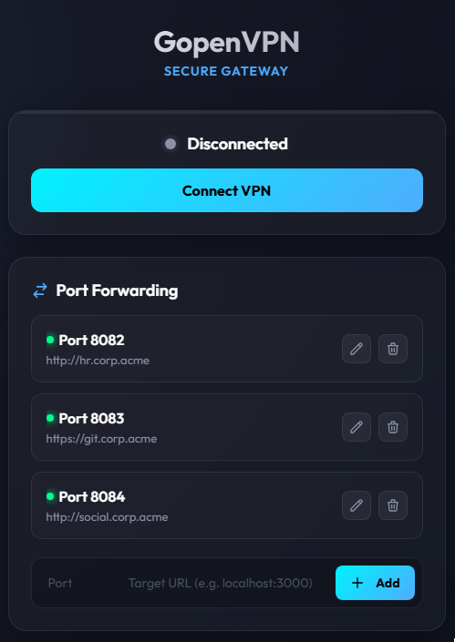
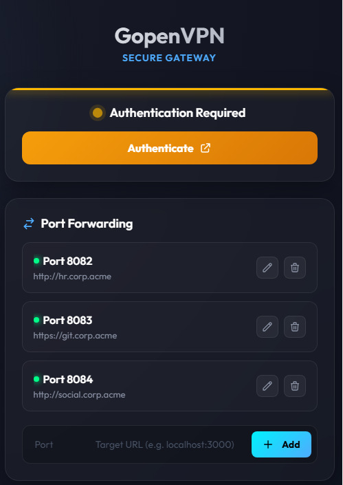
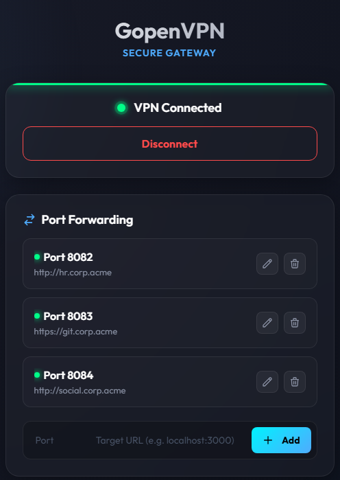

# GopenVPN

**GopenVPN** is an ultra-lightweight web application built in Go and packaged in Docker, specifically designed to manage **OpenVPN 3** profiles that require Web-based authentication (SAML / Single Sign-On).

It is the ideal solution for integrating enterprise VPN connections (like OpenVPN CloudConnexa) with modern access tools like **Warpgate**, eliminating the friction of using terminal clients.

<p align="center">
  
  
  
</p>

---

## 📑 Table of Contents

- [🏗️ Architecture](#️-architecture)
- [🚀 Installation and Usage](#-installation-and-usage)
  - [1. Prepare Environment Variables](#1-prepare-environment-variables)
  - [2. Build and Start](#2-build-and-start)
  - [3. SSO Connection (Warpgate Flow)](#3-sso-connection-warpgate-flow)
- [⚙️ Internal API Endpoints](#️-internal-api-endpoints)
- [🔗 Sharing the VPN Connection (Sidecar Mode)](#-sharing-the-vpn-connection-sidecar-mode)
  - [Option 1: In the same docker-compose.yml](#option-1-in-the-same-docker-composeyml-recommended)
  - [Option 2: From the Command Line](#option-2-from-the-command-line-docker-cli)
  - [⚠️ Important rules about network_mode](#️-important-rules-about-network_mode)

---

## 🏗️ Architecture

The project is designed under a microservice architecture with a highly optimized Docker container:

1. **Backend (Go 1.21)**: An embedded server that interacts directly with the DBus daemon and OpenVPN 3. It automates profile decoding, launches the `session-start` command, intercepts the web authentication URL (SSO) on standard output, and monitors the virtual network interface (`tun0`).
2. **Frontend (HTML/CSS)**: A modern web interface with a *Glassmorphism* design, dark mode, and fluid animations. It is embedded directly within the Go binary (`//go:embed`), so it does not require external static files.
3. **Multi-Stage Docker**: The `Dockerfile` uses a two-stage build process. First, it compiles the Go binary, and then injects it into an `ubuntu:22.04` image. Strict `apt` optimizations are included to achieve a highly compatible final image with required polkit and dbus dependencies.

---

## 🚀 Installation and Usage

### 1. Prepare Environment Variables
You need to have your OpenVPN configuration file (e.g., `profile.ovpn`). GopenVPN requires this file to be passed as a Base64-encoded string to facilitate its safe injection into Docker.

Encode your profile and copy it:
```bash
cat profile.ovpn | base64 -w 0
```

Create a `.env` file in the root of the project and paste the string:
```env
OPENVPN_PROFILE=yOuR_bAsE64_sTrInG_hErE...
```

### 2. Build and Start
Use Docker Compose to bring up the service:
```bash
docker-compose build --no-cache
docker-compose up -d
```

### 3. SSO Connection (Warpgate Flow)
1. Navigate to `http://localhost:8080` (or the port you have configured in Warpgate).
2. Click on **Conectar a la VPN** (Connect to VPN).
3. The frontend will communicate with the Go backend, which will start OpenVPN 3 and retrieve the login URL.
4. A new tab (`target="_blank"`) will automatically open to your VPN provider's portal.
5. Once you successfully log in using your browser, close that tab.
6. The original **GopenVPN** tab will automatically detect the creation of the `tun0` interface and change its state to **Connected**.

### 4. Port Forwarding (Proxies)
GopenVPN includes a built-in reverse proxy (accessible from the UI) that allows you to forward local ports to target web applications running *inside* the VPN. This avoids having to run heavy alternatives like Nginx Proxy Manager.
- Proxy rules are persisted in `/data/proxies.json`.
- For the rules to survive a container restart, you **must** mount the `/data` folder to your host (see docker-compose examples below).
- The reverse proxy automatically supports WebSockets.

---

## ⚙️ Internal API Endpoints

The frontend interacts with the following endpoints exposed by the Go binary:

- `GET /`: Serves the main HTML web interface.
- `POST /api/start`: Initializes DBus, decodes the profile, runs `openvpn3 session-start`, and returns a JSON with the SSO `url` to open.
- `POST /api/stop`: Runs `openvpn3 session-manage --disconnect` to terminate the tunnel.
- `GET /api/status`: Validates at the OS level if the `tun0` interface exists, returning a boolean `{ "connected": true/false }`.
- `GET`, `POST`, `DELETE /api/proxies`: Manage proxy rules dynamically.

---

## 🔗 Sharing the VPN Connection (Sidecar Mode)

Since this container routes its own traffic through the VPN once connected, the primary utility of this project is to use it as a **"Sidecar"** or main network container for other services.

For an external container to use the VPN connection of `gopenvpn`, you must attach the external container's network to the VPN's network using the `network_mode` directive.

### Option 1: In the same `docker-compose.yml` (Recommended)

If you are deploying your applications alongside the VPN, you can use `network_mode: "service:<vpn_service_name>"`.

```yaml
services:
  gopenvpn:
    image: ghcr.io/juliorm0/gopenvpn:latest
    container_name: gopenvpn
    cap_add:
      - NET_ADMIN
    devices:
      - /dev/net/tun
    stdin_open: true
    tty: true
    ports:
      - "8081:80"
    environment:
      - OPENVPN_PROFILE=${OPENVPN_PROFILE}
    volumes:
      - ./data:/data
```

**Note:** If you need to forward ports from the internal network to your host machine, you must declare them in the `ports` section of `gopenvpn` (e.g., `- "8082:8082"`).

### Example of an application attached to network

```yml
services:
  internal_app:
    image: curlimages/curl
    container_name: internal_app
    # The key line
    network_mode: "service:gopenvpn"
    # Since it shares the network stack with gopenvpn,
    # the application cannot expose ports on its own
    # If 'internal_app' needs to expose port 3000,
    # you must declare it in the 'ports' section of 'gopenvpn'
    command: ["sleep", "infinity"]
```

### Option 2: From the Command Line (Docker CLI)

If the VPN container is already running, you can launch any other container on the fly and connect it to its network using `--network container:<container_name>`.

Example to verify that traffic goes out through the VPN:
```bash
docker run --rm -it --network container:gopenvpn curlimages/curl https://ifconfig.me
```

### ⚠️ Important rules about `network_mode`

1. **Shared Ports:** When a container uses the network of another, **it loses the ability to use the `ports` directive**. All ports required by the child container must be published in the parent container (`gopenvpn`).
2. **Localhost:** Both containers share the same network interface (and the same `localhost`). The child container can communicate with the VPN WebApp by making requests directly to `http://localhost:80`.
3. **Dependencies:** The VPN container must start *before* the containers that depend on it. It is recommended to use `depends_on: gopenvpn` in your `docker-compose.yml`.
